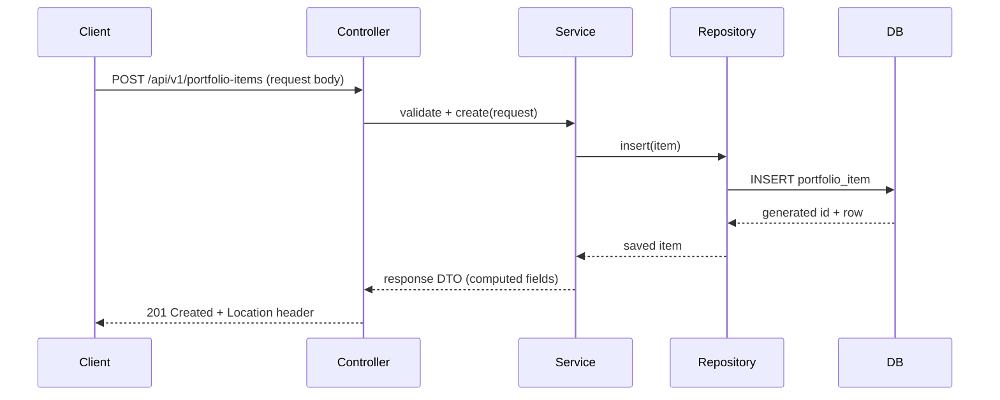
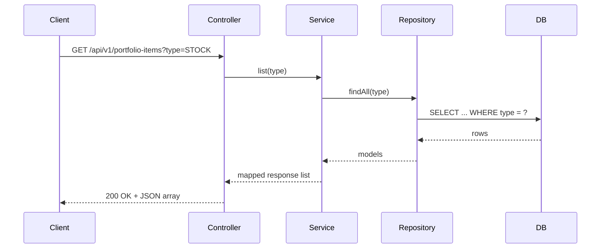
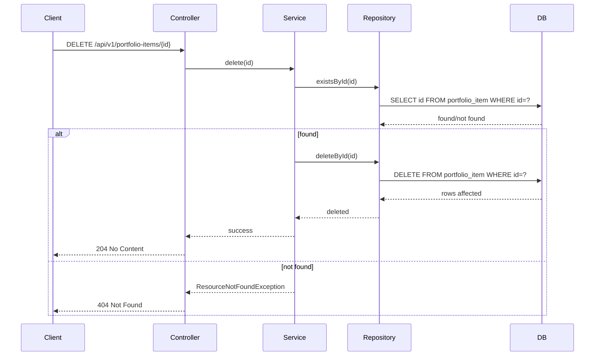
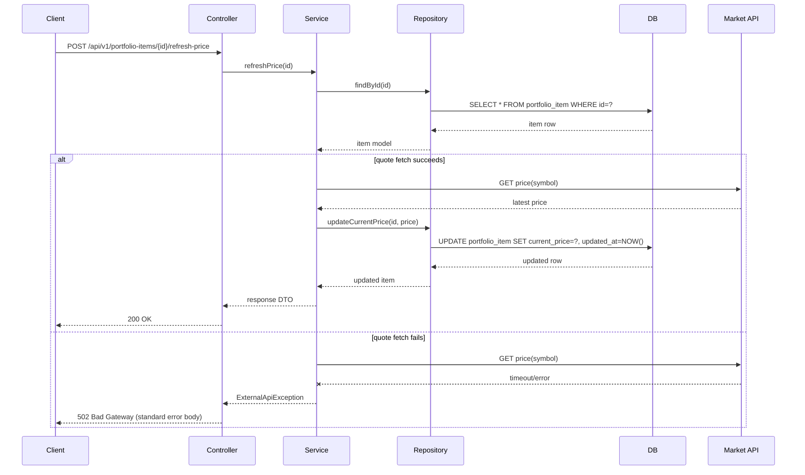
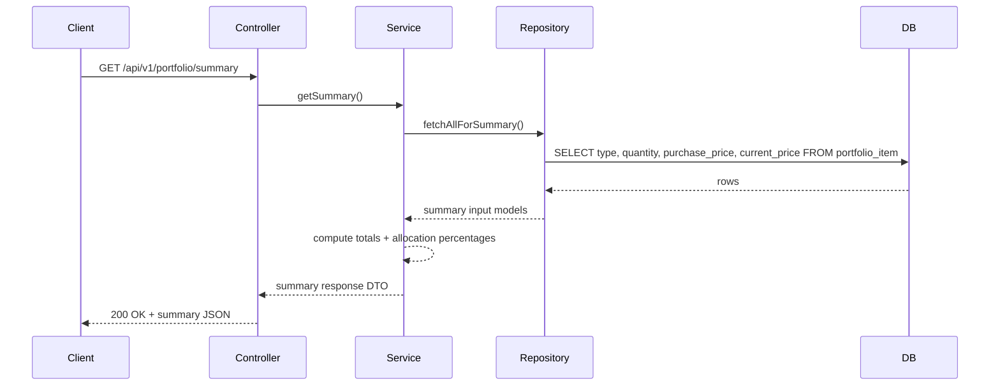

# Sequence Diagrams - Portfolio Management System

This document captures the main runtime interaction flows for v1.
Participants used below:

- `Client` = frontend or API consumer
- `Controller` = REST controller
- `Service` = business logic layer
- `Repository` = JDBC persistence layer
- `DB` = relational database
- `Market API` = external quote provider

## 1. Create Portfolio Item

## 2. List Portfolio Items (Optional Type Filter)

## 3. Delete Portfolio Item

## 4. Refresh Stock Price (Success + Failure)

## 5. Portfolio Summary Endpoint

## 6. Notes

- Validation failures are handled before service logic and return `400`.
- Global exception handling maps domain/infra errors to standardized response JSON.
- Normal list/get operations use stored prices, not live market fetches, to keep latency stable.

